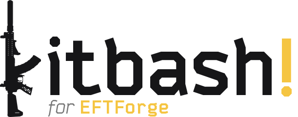

<div align="center">


**实时逃离塔科夫武器配置模拟器，社区配置分享平台**

[](https://www.python.org/)
[](https://fastapi.tiangolo.com/)
[](https://developer.mozilla.org/en-US/docs/Web/JavaScript)
[](LICENSE)
[](https://tarkov.dev)

[English](README.md) · [中文](README_ZH.md)

</div>

---

## 项目简介

EFTForge 是一个逃离塔科夫武器配置模拟器与社区平台。它提供双视图可视化工作台、实时武器属性计算、实时合成配件预览图像、跳蚤市场/商人价格获取、组合计算器、配件图表视图、用户资料系统、配置评论、以及带有排行榜的社区方案发布系统。所有物品数据均通过 [tarkov.dev](https://tarkov.dev) JSON API 获取。

--- 

## 功能特性

### 工作台
- **网格视图** - 配件槽按照武器物理结构在二维画布上空间排列（枪管、枪托、瞄具、握把等），分为区域（上、下、左、右、其他）
- **列表视图** - 传统递归配件树，完整解析槽位与允许物品
- **智能方案识别** - 当已装配件与某保存方案完全一致时，武器显示名称自动同步为该方案名称
- **配件收藏** - 每行配件均有星标按钮，收藏的配件置顶排列，可通过表头开关筛选；存储于 localStorage
- **配置图片导出** - 工作台工具栏的导出按钮可将当前配置渲染为 PNG 图片供保存或分享

### 配件选择器
- **组合计算器** - 对当前槽位进行 BFS 搜索，枚举所有合法配件组合并按所选属性排序；结果实时流式显示并附进度提示；点击一行即安装完整组合
- **配件图表** - 将当前槽位所有配件以两个可配置坐标轴（纵向后坐力、横向后坐力、人机、后坐力修正）绘制散点图；支持缩放、平移、聚簇浏览；可自定义跨武器图表并以 4x 分辨率导出

### 优化器
基于约束求解（MILP，HiGHS 求解器）的武器改装方案求解器，一次性为所有槽位选出最优配件组合，而非逐槽调整。
- **配置取舍曲线** - 根据当前武器的属性限制、配件筛选和商人权限，一次性生成一整条人机工效、后坐力与价格之间取舍的方案曲线，而非单一结果；求解过程实时流式返回，方案会逐步显示在曲线上。可调整采样精度、缩放/平移曲线，选择曲线上的方案查看配件并应用到工作台；搜索未完成时仍保留已找到的可用方案。
- **硬性约束** - 预算上限、最低人机工效、最低弹匣容量、最低瞄准距离、最大MOA、消音器需求，以及防止过摆
- **配件过滤** - 强制包含或禁用指定配件后重新求解；也可直接在配件清单中锁定或禁用某个已选配件后重新求解
- **权重预设** - 保存并复用自定义的权重滑块设置，同时内置常用预设（性价比、最低可用、均衡性能、后坐优先、人机优先）
- **机匣与工厂预设比价** - 比较购买机匣与直接购买武器工厂预设的总价，并按更划算的方案计费
- 与应用其他部分共用相同的商人忠诚度等级、跳蚤市场开关与玩家等级过滤条件
- 优化器的原作者见下方[致谢](#致谢)部分

### 属性计算
- 实时属性：人机功效、后坐力、重量、手臂耐力、瞄准距离
- 完整弹匣装弹重量建模
- 真实配件冲突检测（`conflictingItems` + `conflictingSlotIds`）

### 实时配置预览
- 添加或移除配件时，自动实时生成武器合成图像
- 由自研的 [Kitbash!](#kitbash) 绘制，工作原理见下方专门章节
- 出厂配置与裸枪直接使用 tarkov.dev 静态图
- **Kitbash! 图像生成**开关，可随时关闭生成

### 价格面板
- 当前配置中每件配件的费用明细
- 自动选取商人与跳蚤市场中的最低价格
- PvP / PvE 跳蚤价格缓存切换（独立缓存，切换无需重新请求）
- 每个商人等级设置（LL1-4）
- 配件列表中显示价格标签，一目了然
- 配件选择器**可购**筛选 - 隐藏当前忠诚度下无法购买的配件
- 需要完成商人任务才能解锁的配件会显示任务名称提示

### 属性追踪器
- 展示服务器每日数据同步时自动检测到的物品属性变动
- 每条记录显示旧值/新值、变化百分比及检测日期
- 覆盖滚动 7 天窗口，按日期分组
- 面板顶部显示数据最近一次同步的时间

### 用户资料
- 准本地身份系统：资料令牌存储于 localStorage，无需注册、密码或邮箱
- 上传或更新头像（调整为 128x128 JPEG 后存储于服务端）
- 编辑显示名称；每张社区方案卡片显示作者头像与名称
- 账号迁移流程，可在换设备或浏览器时将历史方案与评论重新绑定至新资料

### 社区平台
- 发布、浏览和加载社区装配方案
- 自动生成合成预览图与用户头像托管于 Gitee [https://gitee.com/morph1ne/eftforge-assets/](https://gitee.com/morph1ne/eftforge-assets/)
- **配置评论** - 每个方案均有独立评论区；作者或管理员可删除评论
- **配置标签** - 每个方案最多添加 5 个预设标签（如 Budget、Recoil、Meta 等）；社区列表顶部显示标签筛选栏，无筛选时自动收起
- **我的社区配置**标签页，可在配置对话框中查看并重新加载自己发布的方案
- 对方案和单个配件进行点赞/踩评分
- **排行榜** - 方案：近期热门 Top 10 / 历史 Top 50；配件：Top 20 / Top 100；支持筛选与排序
- 管理员精选推荐方案
- 方案加载次数统计
- 管理员操作的站内通知
- 管理员工具：推荐、下架、封禁、评论管理、公告

### 方案管理
- 本地保存方案（每设备最多 500 个）
- 通过 LZ-String 压缩的配置码以用于 `?build=` URL 参数舆分享配置
- 页面刷新后自动恢复上次装配进度
- 外部工具深链接支持：通过 `?build=` 参数直接预加载方案

### 本地化
- 中英文双语支持，自动回退
- 中文物品名称翻译与源数据并行存储

---

## Kitbash!

<div align="center">

<picture>
  <source media="(prefers-color-scheme: dark)" srcset="readme-assets/kitbash-for-eftforge-wordmark.png">
  
</picture>

*自定义塔科夫配置，毫秒级渲染。*

<sub>标志中的步枪是由 Kitbash! 绘制的真实配置。<a href="https://eftforge.com/?build=N4IgbiBcCMA0IHMogGwAYUFYAcB2ATJoQMyYDGmuAhtMQCz51kBmAJiPAA5QDaPqGHASKZSFarQZNmzDiEwBOVgCNiNVthTNcuBgoCmaTMrr6F%2BEAF1Y-dFjyES5SjXqNWaNHMWsU%2BAnSa2rooKNB0KMRBsta2gg4iYi6S7mjQcnZCVNjYCp6sZPisClSYxlgKVjYC9sJO4q5SHhbw5LgKxMzK5vr4%2BNAodHTMxNDKXYNVcbWOos4SbnQexBnxuMq%2BHhu4OBjQ61RkZFM1WTl5aAVFJWXKWMfwmXi4WvhkyviG%2BFQMh73KJye1HO%2BUKxVK5Uw7Ee8WwaDItCKS2gb2w0DY2FYVEBa2yuVB1whd0w%2Bm8yjIaBK0ExdFI0EMaFIfju2FJsXkZHanW6nz6AyGIzGExQGSIHVw8LoRlKzEw0FYzWIKmwONqL2Ybw%2BXx%2B3zIvWhqFokuIZBQEuwJLoJOY4Wl6XZQPVms%2BaG%2Bvz1n1WWAK2FcSNYKLIaIx%2BhWDth8MRrGRqPRGkMZIpJWIl1pcoZxDNXVwQdVODhCOI-sDwY0rFkrRzMjufitCh0kXwIwU0CoCkqDqNZFppvNluttswVBWrXLw9Y%2BGUl30%2BjGfWYmk%2BVFYbOsIGxkHkBiWSvwQR0dH2KGHfkwaGxAF8gA">在 EFTForge 中打开</a></sub>

</div>

Kitbash! 是 EFTForge 自研的配置图像渲染器，由 EFTForge 的作者 [Morph1ne](https://github.com/SouthHorizons76) 开发。站内所有配置图像均由它绘制：工作台实时预览、配置标签页悬停预览、优化器结果预览、导出的 PNG 图片，以及社区方案卡片等等。

Kitbash! 是一个独立项目。其仓库目前为私有，若需求足够，未来可能会开源哦！

### 工作原理
- 每把武器和每个配件都会预先离线用游戏自身的模型渲染一次，生成带深度图的精灵图
- 运行时通过将这些精灵图按二维偏移叠放并进行深度测试来拼装整套配置，因此渲染时无需游戏客户端、GPU 或浏览器
- 之所以可行，是因为游戏的物品栏图标相机是正交投影：配件的轮廓不随位置变化，其屏幕位置可直接由三维挂载点推算
- 合成器以进程内方式运行于 FastAPI 后端（Pillow），输出为游戏物品栏图标两倍尺寸的 WebP 图像

### 绘制内容
- **弹药渲染** - 开启**装满弹匣**时，弹匣会按所选弹药绘制为装满状态，下挂榴弹发射器也会装填弹药，与游戏内一致
- **新武器** - tarkov.dev 暂无图片的武器，由 Kitbash! 按其工厂预设或裸机匣绘制
- **缺失配件** - Kitbash! 暂时无法绘制的配件会从图像中略去，而不会导致整张图生成失败，同时会提示有部分配件未显示
- **社区方案卡片** - 只绘制一次并永久存储于 Gitee；由于卡片会长期保留，需等到 Kitbash! 能绘制方案中的所有配件后才会生成

### 缓存
- 渲染结果按完整配件树与所装弹药缓存，再次查看同一配置可立即显示
- 解码后的精灵图在每个工作进程中单独缓存（`KITBASH_CACHE_MB`，默认 128 MB）

---

## 技术栈

| 层级 | 技术 |
|---|---|
| 后端 | Python、FastAPI、SQLAlchemy、SQLite、Pydantic、Uvicorn |
| 前端 | 原生 JavaScript（ES2022），模块化架构 |
| 图像生成 | [Kitbash!](#kitbash)（自研精灵图合成器，Pillow） |
| 资源托管 | Gitee（社区方案卡片图像、用户头像） |
| 数据来源 | tarkov.dev JSON API、[SP-Tushonka](https://github.com/SP-Tushonka)（隐藏武器与弹药属性） |
| 压缩 | LZ-String |
| Markdown | marked.js |

---

## 桌面版

EFTForge 还提供可下载的 Windows 桌面版 - 同样的工作台与属性计算，通过本地后端原生运行在你的电脑上，并可选择是否连接线上社区服务器。如果你所在地区访问我们的服务器较慢，或者你希望在网站服务临时中断时也能继续正常使用（仅社区功能暂时不可用，恢复后即可继续），桌面版会很有用。需要注意的是，无论哪种模式都仍然需要联网，因为物品数据与图片是直接从 [tarkov.dev](https://tarkov.dev) 获取的，与 EFTForge.com 是否可用无关。

- **下载：** [GitHub Releases](https://github.com/SouthHorizons76/EFTForge/releases) - 如果 GitHub 访问较慢或不稳定，也可以使用 [Gitee 镜像](https://gitee.com/morph1ne/eftforge-gitee-mirror/releases)
- **详细说明：** 架构、本地开发与构建方法见 [desktop/README.md](desktop/README.md)

---

## 快速开始

### 环境要求

- Python 3.10+
- 现代浏览器（Chrome、Firefox、Edge 等）

---

### 1. 克隆Repo

```bash
git clone https://github.com/SouthHorizons76/EFTForge.git
cd EFTForge
```

---

### 2. 配置 `launch.bat`

在运行任何命令之前，用文本编辑器打开 `launch.bat`。

**浏览器路径** - 启动器会自动打开浏览器标签页。默认路径指向 Windows 上的 Chrome。如果你使用其他浏览器，请修改这行：

```bat
start "" "C:\Program Files\Google\Chrome\Application\chrome.exe" --new-window ...
```

其他浏览器示例：
```bat
# Firefox
start "" "C:\Program Files\Mozilla Firefox\firefox.exe" -new-window ...

# Microsoft Edge
start "" "C:\Program Files (x86)\Microsoft\Edge\Application\msedge.exe" --new-window ...
```

**安装 Python 依赖**，在 `backend/` 目录下执行：

```bash
cd backend
python -m venv venv
venv\Scripts\activate
pip install -r requirements.txt
cd ..
```

---

### 3. 配置 `.env`

```bash
cd backend
copy .env.example .env
```

编辑 `backend/.env`。以下两个变量为**必填项** - 缺少任意一个服务将拒绝启动：

```env
IP_HASH_SECRET=任意随机字符串
ADMIN_API_KEY=你的管理员密钥
```

本地开发时填写任意非空值即可。生产环境请使用强随机值（`openssl rand -hex 32`）。

完整 `.env` 参考（除上述两项外均为可选）：

```env
DATABASE_URL=sqlite:///./tarkov.db
RATINGS_DB_URL=sqlite:///./ratings.db
BUILDS_DB_URL=sqlite:///./builds.db
CORS_ORIGINS=http://127.0.0.1:5500
ENABLE_API_DOCS=0            # 设为 1 可启用 /docs 和 /redoc
TRUSTED_PROXY_IPS=127.0.0.1,::1

# 社区方案图像生成（可选，只用于公开服务器）
GITEE_TOKEN=                 # 用于上传方案卡片图像的 Gitee 个人访问令牌
GITEE_DRY_RUN=0              # 设为 1 可模拟上传而不实际写入 Gitee
DISABLE_BG_MIGRATE=0         # 设为 1 可禁用后台图像迁移任务
```

---

### 4. 运行 `launch.bat`

```bat
launch.bat
```

这一条命令会完成以下所有操作：
- **首次运行**：重建数据库、从 tarkov.dev 同步全部物品数据，然后再启动，因为此时还没有数据可提供
- **后续运行**：直接基于已有的本地数据库立即启动 FastAPI 后端，同时在后台重新同步 tarkov.dev 数据
- 在 `http://127.0.0.1:8000` 启动 FastAPI 后端
- 在 `http://127.0.0.1:5500` 提供前端服务
- 自动打开浏览器标签页

后端控制台显示 **"Application startup complete"** 后即可使用网站。如果后台同步发现了新数据，会弹出提示引导你刷新页面；否则不会有任何变化，你可以继续使用已有数据。此时EFTForge已经成功运行了。

> **注意：** `sync_tarkov_dev.py` 由launch.bat自动调用。本地开发时请尽量不要直接运行该脚本，它仅用于生产服务器上的手动计划外数据重同步。

---

## API 概览

后端默认运行于 `http://127.0.0.1:8000`。在 `.env` 中设置 `ENABLE_API_DOCS=1` 后可在 `/docs` 查看交互式文档。

| 分组 | 端点 |
|---|---|
| 物品 | `GET /guns`、`GET /ammo/{caliber}`、`GET /items/{id}/slots`、`GET /slots/{id}/allowed-items`、`GET /graph/searchable-items` |
| 装配 | `POST /build/validate`、`POST /build/calculate`、`POST /build/batch-process`、`POST /build/combo-batch-process`、`POST /build/combo-full`、`GET /guns/{gun_id}/init` |
| 优化器 | `POST /build/optimize`、`POST /build/stat-ranges`、`POST /build/moa-floor`、`GET /build/mods`、`GET /build/default-preset`、`GET /build/gunsmith-tasks`、`POST /build/gunsmith-solve` |
| 图像生成 | `POST /build-image` |
| 评分 | `GET /ratings/attachments/bulk`、`POST /ratings/attachments/{id}/vote`、`DELETE /ratings/attachments/{id}/vote`、`GET /ratings/builds/bulk`、`POST /ratings/builds/{id}/vote` |
| 社区方案 | `POST /builds/publish`、`GET /builds/public`、`GET /builds/mine`、`POST /builds/{id}/load`、`DELETE /builds/{id}` |
| 评论 | `GET /builds/{id}/comments`、`POST /builds/{id}/comments`、`DELETE /builds/{id}/comments/{comment_id}` |
| 用户资料 | `POST /profile/avatar`、`POST /profile/update`、`POST /profile/transfer/preview`、`POST /profile/transfer` |
| 通知 | `GET /builds/notifications`、`GET /announcements` |
| 属性追踪 | `GET /stat-changelog` |
| 健康检查 | `GET /health` |
| 管理员 | 方案管理、评论管理、作者管理、封禁系统、公告、迁移工具 |

---

## 外部配置加载

外部工具可通过 `?build=` URL 参数直接跳转到 EFTForge 并预加载装配方案：

```
https://eftforge.com/?build=<lzstring编码的装配码>
```

装配码为经 LZ-String 压缩、URL 安全编码的 JSON 载荷：

```json
{ "v": 1, "g": "<gunId>", "p": [["slotId", "itemId"], ...], "a": "<ammoId>" }
```

EFTForge 将在页面加载时自动导入装配方案并清除 URL 参数。物品 ID 须与 EFTForge 内部的 tarkov.dev 物品 ID 保持一致。

---

## 致谢

EvoErgo 概念由 **SpaceMonkey37** 原创提出。EFTForge 在其基础上实现并扩展了这一系统。没有 SpaceMonkey37 的基础理论，本项目将无从实现。

基于约束求解的改枪优化器（MILP 求解器、优先级加权、预算/商人等级过滤）是参考 **AhaiMk01** 的 [塔科夫改枪优化器](https://github.com/AhaiMk01/tarkov-weapon-optimizer) 项目思路后原生重新实现的。

---

## 开源协议

EFTForge 采用 [GNU Affero 通用公共许可证 v3.0 或更高版本](LICENSE)（AGPL-3.0-or-later）授权。如果你分发修改后的版本，或将其作为服务通过网络提供给他人使用，则必须以相同许可证公开完整源代码，并保留对 EFTForge 的署名。署名要求以及仍适用 MIT 许可证的贡献，详见 [NOTICE](NOTICE)。

改用 AGPL 之前发布的版本仍可按 MIT 许可证使用。

---

## 免责声明

EFTForge 与 Kitbash! 均为第三方自制项目，与 Battlestate Games 官方无任何关联。游戏内数据来源于 [tarkov.dev](https://tarkov.dev) 与 [SP-Tushonka](https://github.com/SP-Tushonka)。
